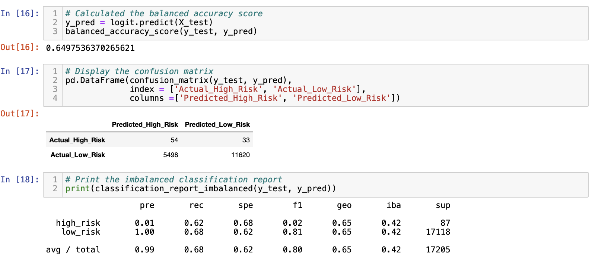
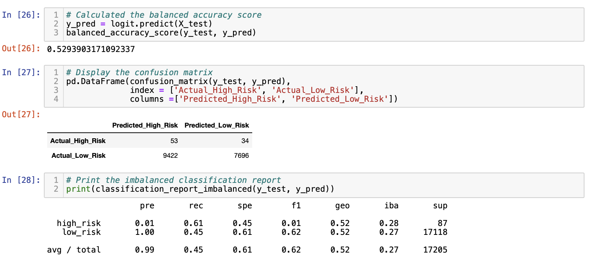
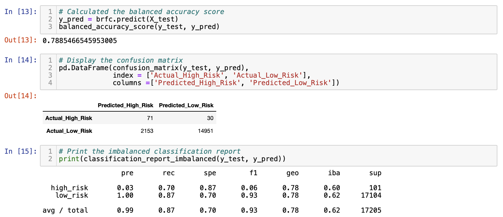
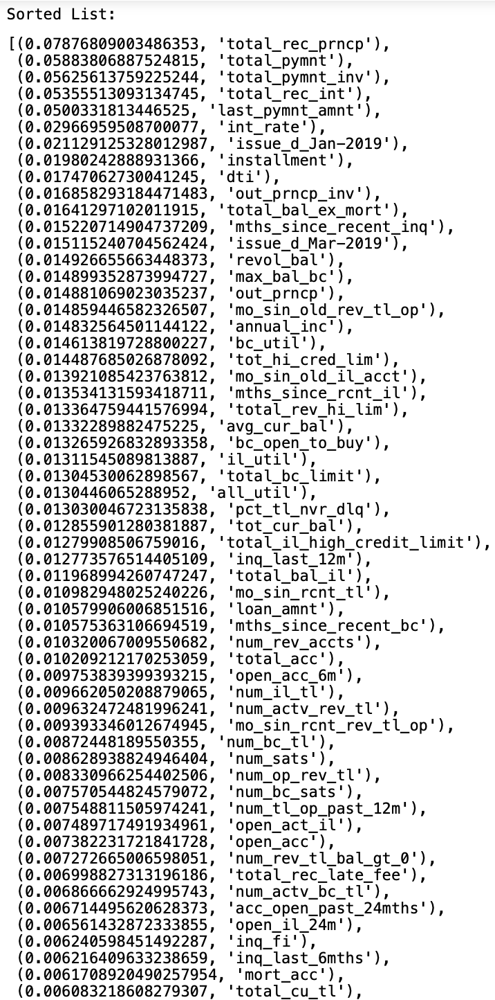
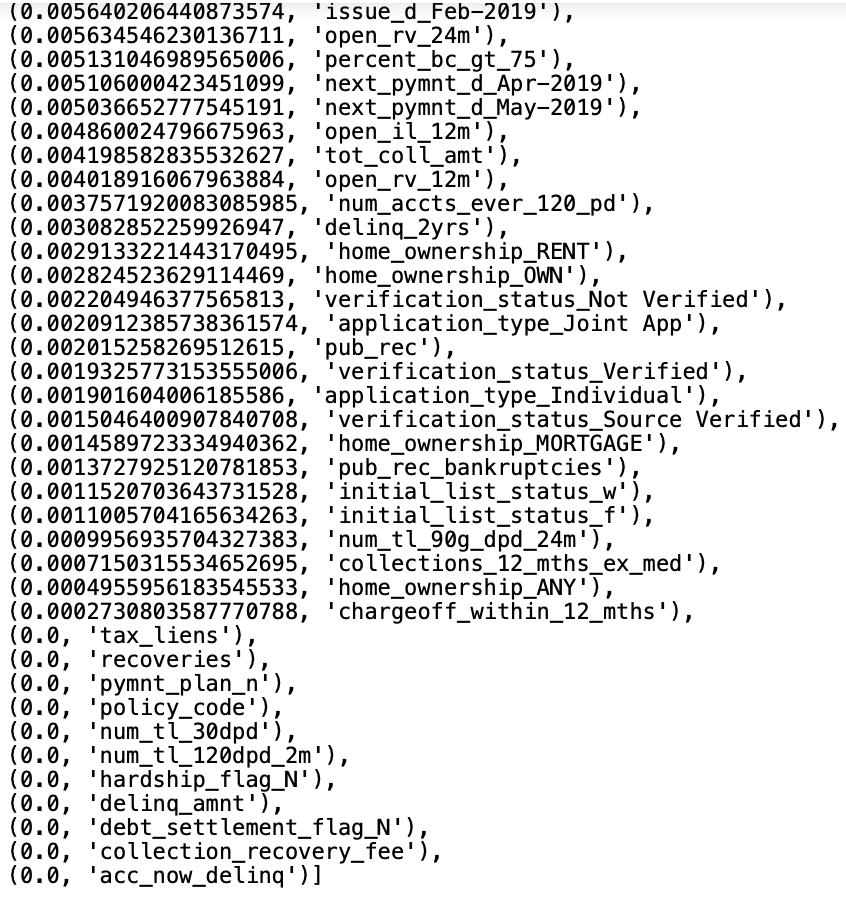
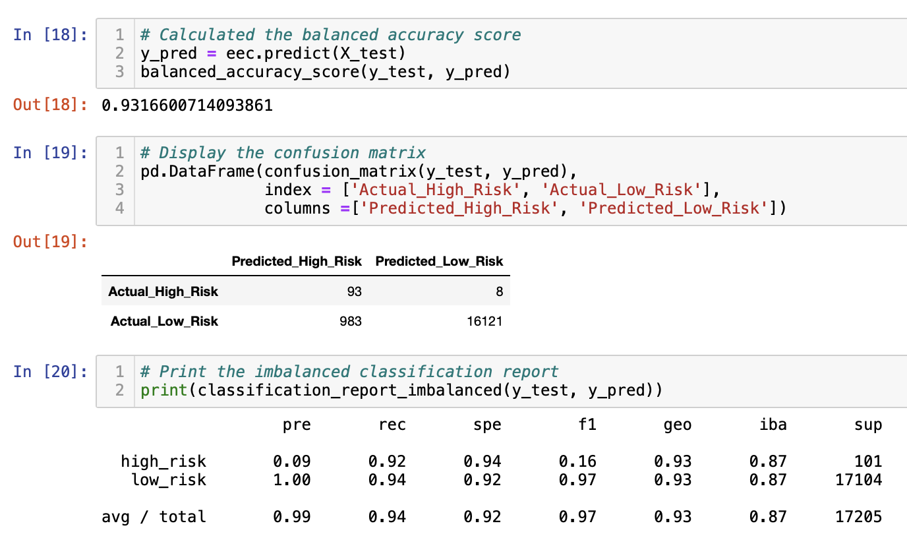

# Credit Risk Analysis 

# Overview of the Analysis

The study used a credit card credit dataset consisting of 68,817 loans in order to build and evaluate several machine learning models that aim to predict credit risk. Due to the imbalance between the quantities of high risk and low risk loans, the data was first resampled using several algorithims such as SMOTE, random oversampling, cluster centroid, and SMOTEEN combination. Several logistic regression models were then trained on the different resampled data. Additional models such as the Balanced Random Forest Classifier and the Easy Ensemble Classifier were also trained on the imbalanced data. The performance of all the models were evaluated based on their accuracy, precision and recall scores.

The results of the study aim to help lending institutions quickly and accurately identify good candidates for loans. This will aid in streamlining the loan application process and lowering loan default rates.

# Results

    <strong> Random Oversampling </strong>  
    

- After random oversampling of the data, the logistic regression model had an accuracy score of 0.6497536370265621. This means that about 64.98% of the sampled loans were correctly classified by the model as either high risk when they were actually high risk or low risk when they were actually low risk. 
- In predicting high risk loans, the model had a low precision of 0.01 and a recall of 0.62. This implies that there is a 1% chance that a loan is actually high risk when the model predicts it to be high risk. Meanwhile, there is a 62% chance that actual high risk loans are correctly identified by the model. 
- In predicting low risk loans, the model had a high precision of 1 and a recall of 0.68. This implies that there is a 100% chance that a loan is actually low risk when the model predicts it to be low risk. Meanwhile, there is a 68% chance that actual low risk loans are correctly identified by the model. 

    <strong> SMOTE Oversampling</strong>  
    

- After SMOTE oversampling of the data, the logistic regression model had an accuracy score of 0.6443721269403855. This means that about 64.44% of the sampled loans were correctly classified by the model as either high risk when they were actually high risk or low risk when they were actually low risk. 
- In predicting high risk loans, the model had a low precision of 0.01 and a recall of 0.63. This implies that there is a 1% chance that a loan is actually high risk when the model predicts it to be high risk. Meanwhile, there is a 63% chance that actual high risk loans are correctly identified by the model. 
- In predicting low risk loans, the model had a high precision of 1 and a recall of 0.66. This implies that there is a 100% chance that a loan is actually low risk when the model predicts it to be low risk. Meanwhile, there is a 66% chance that actual low risk loans are correctly identified by the model. 

    <strong> Cluster Centroids Undersampling</strong>  
    

- After Cluster Centroids undersampling of the data, the logistic regression model had an accuracy score of 0.5293903171092337. This means that about 52.94% of the sampled loans were correctly classified by the model as either high risk when they were actually high risk or low risk when they were actually low risk. 
- In predicting high risk loans, the model had a low precision of 0.01 and a recall of 0.61. This implies that there is a 1% chance that a loan is actually high risk when the model predicts it to be high risk. Meanwhile, there is a 61% chance that actual high risk loans are correctly identified by the model. 
- In predicting low risk loans, the model had a high precision of 1 and a recall of 0.45. This implies that there is a 100% chance that a loan is actually low risk when the model predicts it to be low risk. Meanwhile, there is a 45% chance that actual low risk loans are correctly identified by the model. 

    <strong> SMOTEEN Combination Sampling </strong>  
    

- After SMOTEEN combination sampling of the data, the logistic regression model had an accuracy score of 0.6377215353066544. This means that about 63.77% of the sampled loans were correctly classified by the model as either high risk when they were actually high risk or low risk when they were actually low risk. 
- In predicting high risk loans, the model had a low precision of 0.01 and a recall of 0.71. This implies that there is a 1% chance that a loan is actually high risk when the model predicts it to be high risk. Meanwhile, there is a 71% chance that actual high risk loans are correctly identified by the model. 
- In predicting low risk loans, the model had a high precision of 1 and a recall of 0.56. This implies that there is a 100% chance that a loan is actually low risk when the model predicts it to be low risk. Meanwhile, there is a 56% chance that actual low risk loans are correctly identified by the model.

    <strong> Balanced Random Forest Classifier</strong>  
    
    
    

-  After using the Balanced Random Forest Classifier, the model had an accuracy score of 0.7885466545953005. This means that about 78.85% of the sampled loans were correctly classified by the model as either high risk when they were actually high risk or low risk when they were actually low risk. 
- In predicting high risk loans, the model had a low precision of 0.03 and a recall of 0.70. This implies that there is a 3% chance that a loan is actually high risk when the model predicts it to be high risk. Meanwhile, there is a 70% chance that actual high risk loans are correctly identified by the model. 
- In predicting low risk loans, the model had a high precision of 1 and a recall of 0.87. This implies that there is a 100% chance that a loan is actually low risk when the model predicts it to be low risk. Meanwhile, there is a 87% chance that actual low risk loans are correctly identified by the model.
- The top five important features that the model used in terms of classification are the following: 'total_rec_prncp', 'total_pymnt', 'total_pymnt_inv','total_rec_int', and 'last_pymnt_amnt'. 

    <strong> Easy Ensemble Classifier</strong>  
    

-  After using the Easy Ensemble Classifier, the model had an accuracy score of 0.9316600714093861. This means that about 93.17% of the sampled loans were correctly classified by the model as either high risk when they were actually high risk or low risk when they were actually low risk. 
- In predicting high risk loans, the model had a low precision of 0.09 and a recall of 0.92. This implies that there is a 9% chance that a loan is actually high risk when the model predicts it to be high risk. Meanwhile, there is a 92% chance that actual high risk loans are correctly identified by the model. 
- In predicting low risk loans, the model had a high precision of 1 and a recall of 0.94. This implies that there is a 100% chance that a loan is actually low risk when the model predicts it to be low risk. Meanwhile, there is a 94% chance that actual low risk loans are correctly identified by the model.

# Summary

The Balanced Random Forest Classifier and all the logistic regression models trained on different resampled data using SMOTE, random oversampling, cluster centroid, and SMOTEEN combination algorithms had very similar results. Their precision scores in predicting high risk loans were all close to zero indicating that their predictions had a lot of false positives. This means that several low risk loans were  misclassified as high risk. In terms of recall, the scores of these models ranged from 61%-71%. This indicates that among the high risk loans, a fair amount were correctly identified by these models. 

With an accuracy of 78.85%, the Balanced Random Forest Classifier preformed better than all the logistic regression models which had accuracy scores no greater than 65%. 

The Easy Ensemble Classifier, however, had the highest accuracy of 93.17%. This model also had the highest recall of 92% which means that almost all of the high risk loans were correctly identified by it. However, just like the Balanced Random Forest Classifier and all the logistic regression models, it had a low precision score of 9% in predicting high risk loans. 

# Recommendation

The Easy Ensemble Classifier is recommended for credit risk classification because it has the highest accuracy and recall score among the machine learning models used in the study. Relative to precison, having a high recall is more important in this context because lending institutions should be able to correctly identify the risky loans among those that are actually risky. If loan applications are guided by a model with a low recall for detecting high risk loans then a lot of high risk borrowers will be granted a loan. This will lead to high default rates and large financial losses for the lending institution. 

 The low precison of this model caused by a lot of false positives shouldn't be a problem. Lending instutions have several other vetting processes in addition to the credit risk classification done by a machine learning model. If a low risk loan application is missclassified by the model as high risk then further assessments that use different metrics will be performed to correct this. 

